# 🏨 SRM Hostel Booking System (Flask)


---

## 📌 Overview

*SRM Hostel Booking System* is a full-stack responsive web application developed using *Flask*, aimed at simplifying hostel room reservations for SRM University students. It includes user authentication, booking management, real-time PDF receipt generation, a chatbot assistant, and more.

---

## 🚀 Features

- 🔐 *Login/Signup* with email, password, phone number
- 📋 *Dashboard* with key options:
  - ✅ Book Hostel (AC & non-AC options + cot preference)
  - ❌ Cancel Booking (via unique Booking ID)
  - 👀 View Slots Left (static, 100 slots displayed)
  - 📥 Download Receipt (PDF format)
  - 🙍 View/Update Profile
  - 💬 JavaScript Chatbot for help
  - 🚪 Logout functionality

- 🧾 *Booking Flow*:
  - Room type & cot preference selection
  - Fill booking form → shows Booking ID
  - Auto-redirects to receipt page
  - Receipt can be downloaded as PDF using receipt.js

- 📱 *Responsive design* (Web, Tablet, Mobile)
- ☁ Hosted on [Render](https://render.com/)
- 🗃 Cloud database via FreeMySQLHosting (with phpMyAdmin)

---

## 🌐 Live Demo

🔗 [Visit the App](https://srm-hostel-booking-system-flask.onrender.com)

---

## ⚙ Tech Stack

- *Backend*: Python (Flask)
- *Frontend*: HTML, CSS, JavaScript
- *Database*: MySQL (phpMyAdmin via FreeMySQLHosting)
- *Hosting*: Render
- *PDF Export*: JavaScript-based

---

## 🛠 Server Optimization

- ⏰ [cron-job.org](https://cron-job.org) — wakes the server every 2 minutes to avoid sleep downtime
- 📶 [UptimeRobot](https://uptimerobot.com) — monitors uptime every 5 minutes

---

## 📸 Screenshots

> Screenshots stored in screenshots/ folder

| Page | Screenshot |
|------|------------|
| 🏠 Index Page | 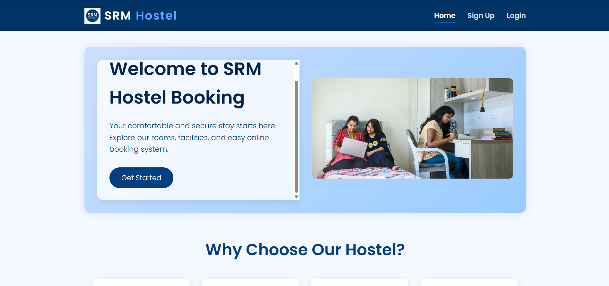 |
| 🔐 Login Page | 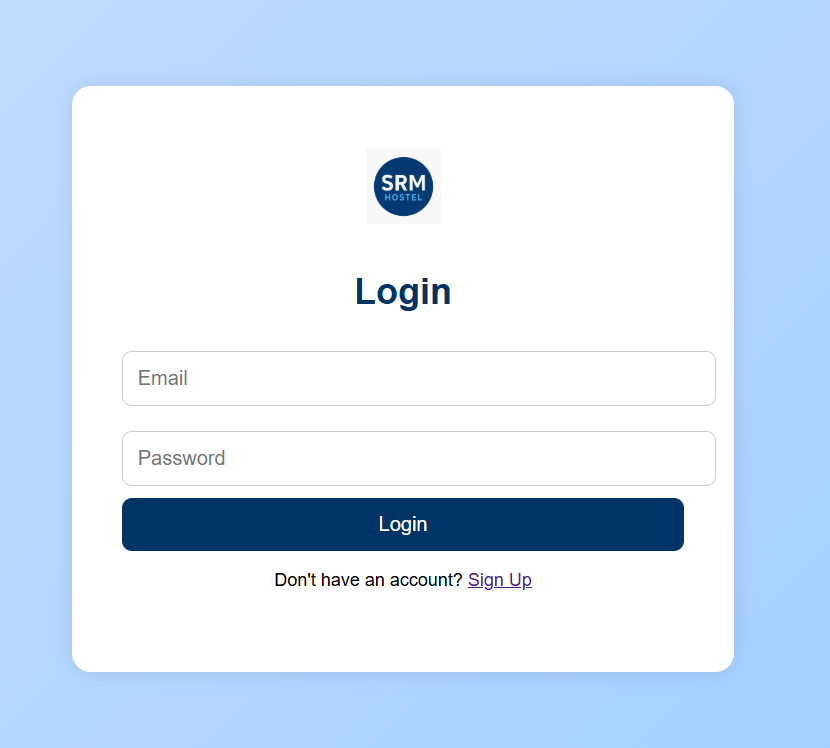 |
| 📝 Signup Page | 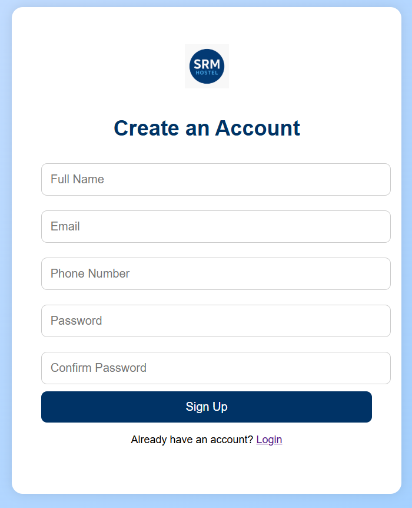 |
| 🧭 Dashboard | 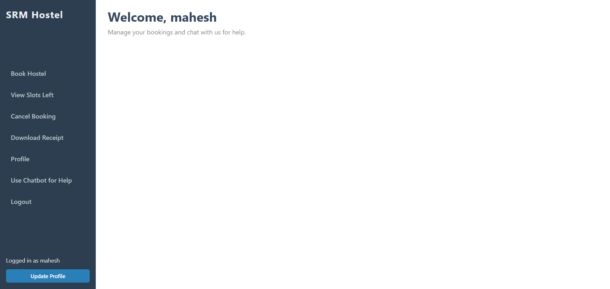 |
| ❌ Cancel Booking | 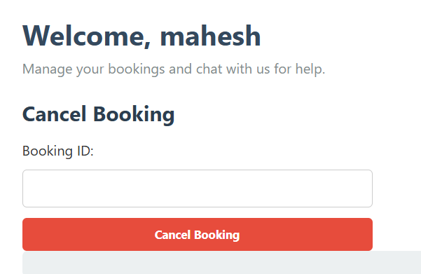 |
| 🙍 Profile Page | 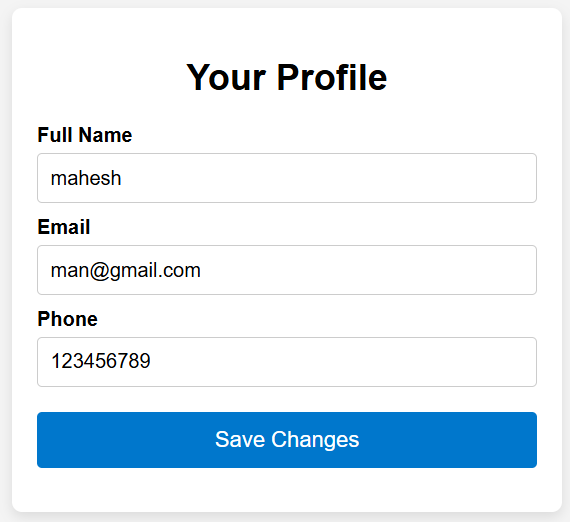 |
| 💬 Chatbot Help | 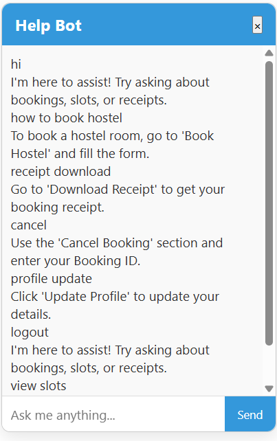 |
| 🏨 Booking Options | 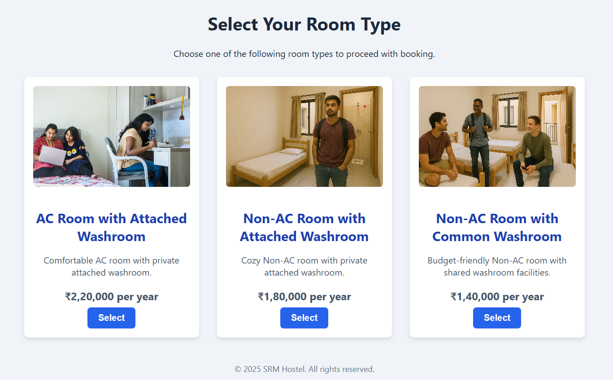 |
| 🧾 Booking Form | 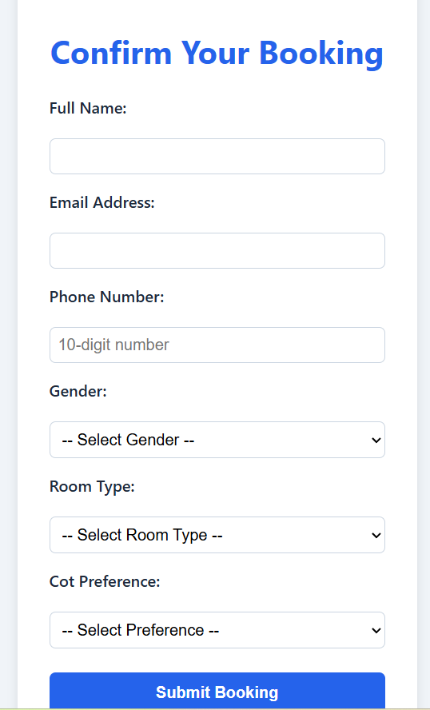 |
| ✅ Booking Success | 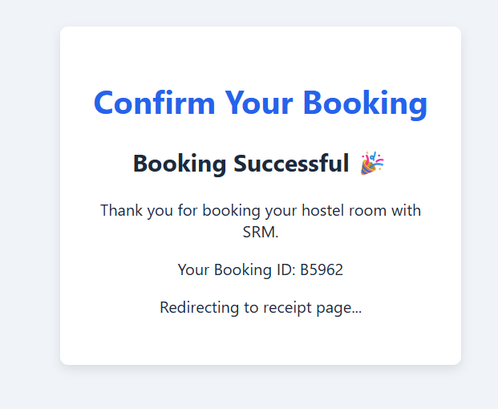 |
| 📋 Receipt Page | 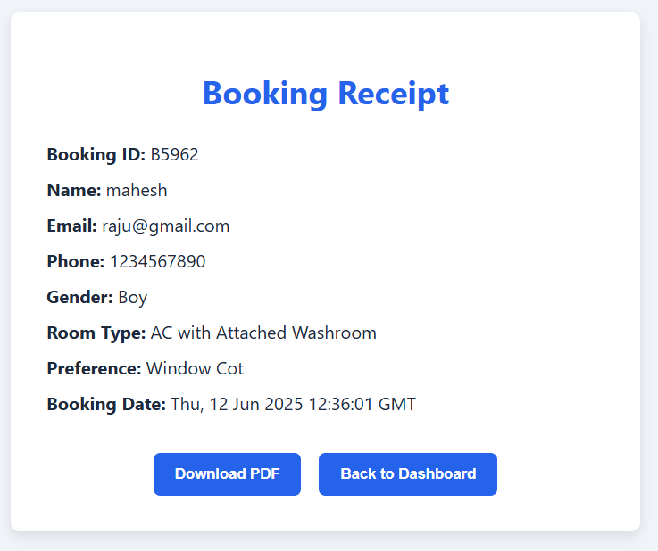 |
| 📄 Receipt PDF | 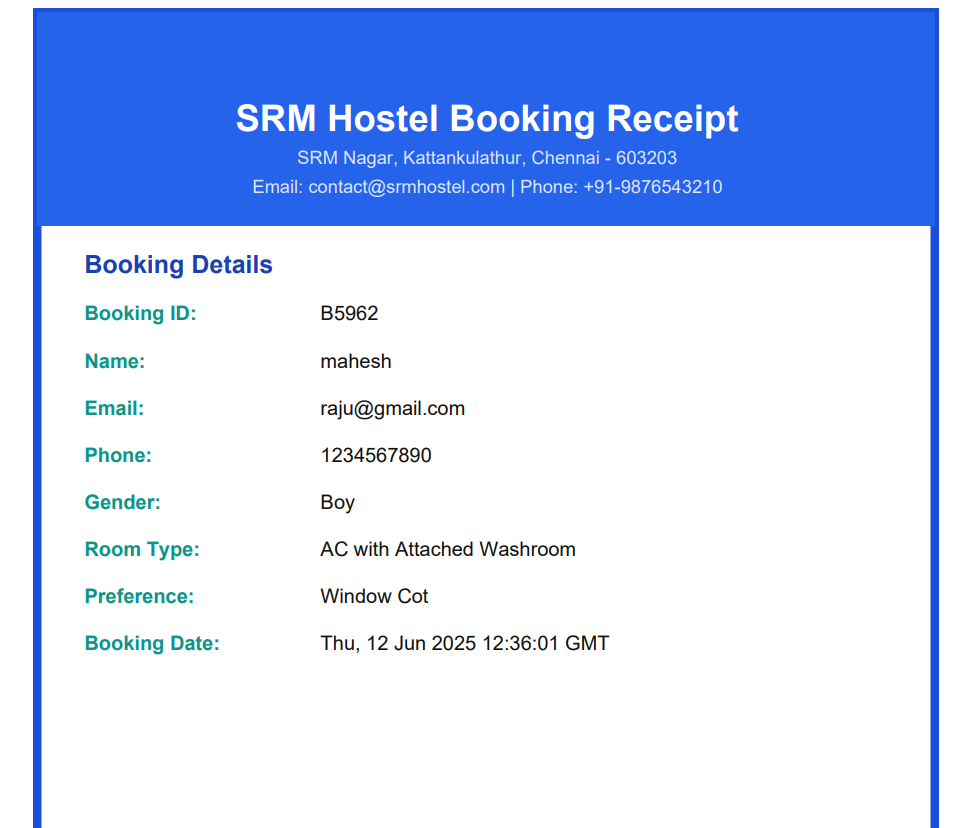 |

---

## 🧪 How to Run Locally

1. *Clone the Repository*:
   ```bash
   git clone https://github.com/maheshreddymaram2/SRM-Hostel-Booking-System-Flask.git
   cd SRM-Hostel-Booking-System-Flask
